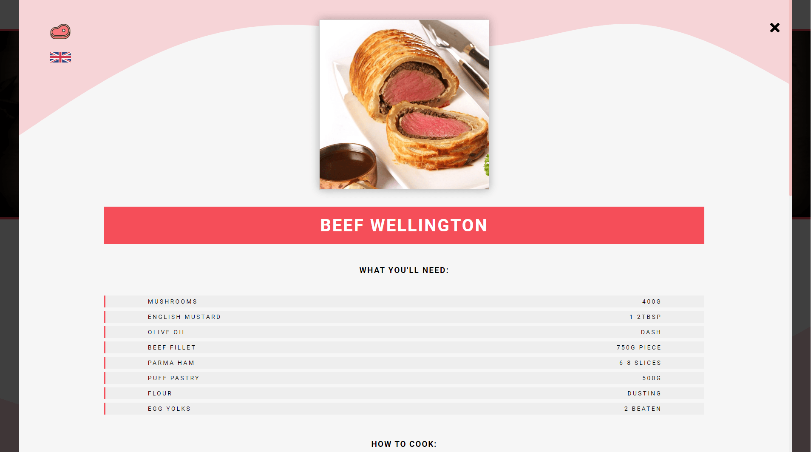
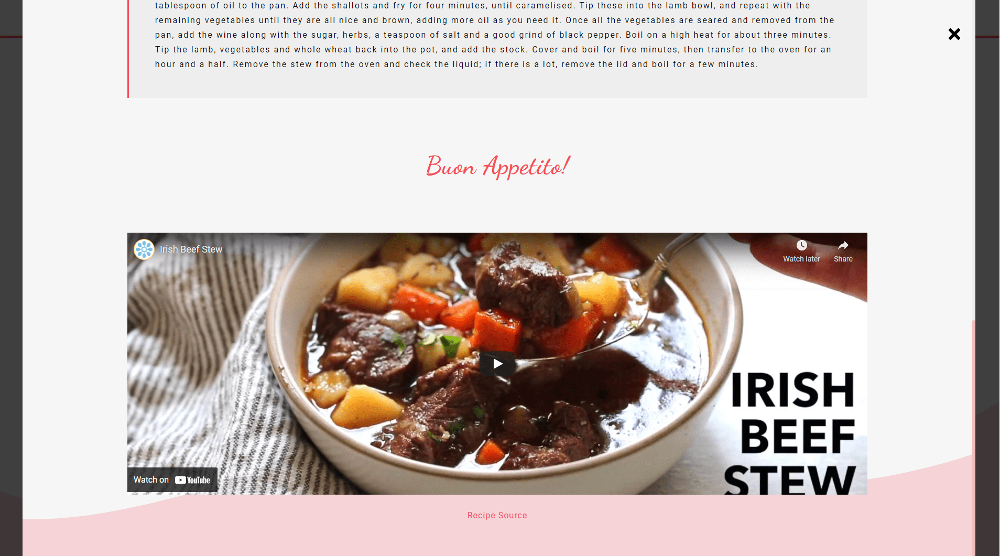

# Phil's Recipes

This is my very first **React** project and is a remake of my Vanilla JavaScript [My Foods App](https://github.com/philipHinch/my-foods-app).

Here you can search your favourite meals and filter them by category. 

When clicking on a meal, a modal will pop up with all the detailed info about that meal.

The recipes are fetched from [TheMealDB](https://www.themealdb.com/) API.

[View Project](https://phils-recipes.netlify.app/)

---

The technologies used in this project are:

1. HTML
2. CSS
3. JAVASCRIPT
4. REACT
5. USESTATE & USEEFFECT HOOKS
6. FUNCTIONAL COMPONENTS
7. FETCH API
8. CSS ANIMATIONS

---

This project was bootstrapped with [Create React App](https://github.com/facebook/create-react-app).

## Available Scripts

In the project directory, you can run:

### `npm start`

---

Here are some previews:

---

---

[View Project](https://phils-recipes.netlify.app/)

