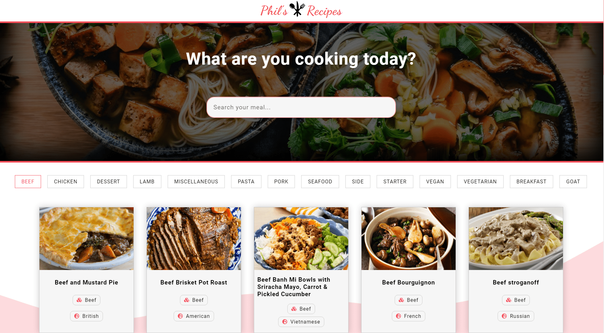

# Phil's Recipes

This is my very first **React** project and is a remake of my Vanilla JavaScript [My Foods App](https://github.com/philipHinch/my-foods-app).

The amount of time I spent building this project (being my first react project) helped me really understand how some fundamental react concepts work.

Here you can search your favourite meals and filter them by category. 

When clicking on a meal, a modal will pop up with all the detailed info about that meal.

The recipes are fetched from [TheMealDB](https://www.themealdb.com/) API.

I used useState & useEffect hooks for state management. 

[View Project](https://phils-recipes.netlify.app/)

---

The technologies used in this project are:

1. HTML
2. CSS
3. JAVASCRIPT
4. REACT
5. USESTATE & USEEFFECT HOOKS
6. FUNCTIONAL COMPONENTS
7. FETCH API
8. CSS ANIMATIONS

---

In the project directory, you can run:

### `npm start`

---

Here are some previews:

---

---

[View Project](https://phils-recipes.netlify.app/)

